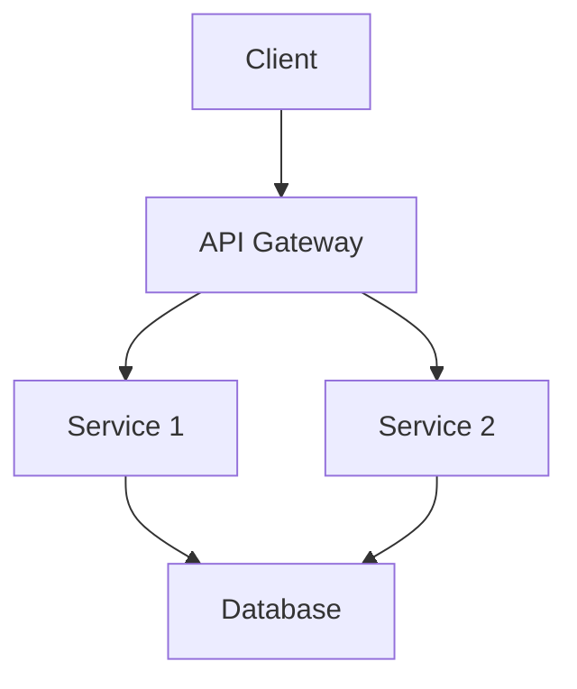
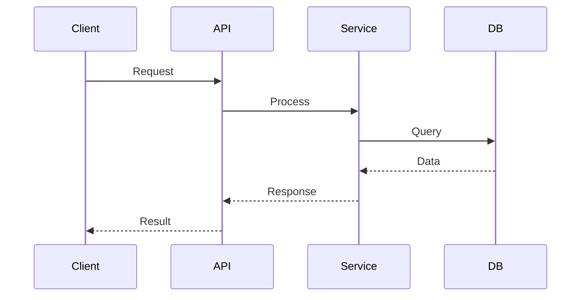

# Generate Imported Page

Generate a new imported slide page in the `pages/` directory for organizing presentation content into separate, reusable files.

## Instructions

When the user requests to create an imported page:

1. **Ask the user for**:
   - The page name/filename (e.g., `architecture-overview`, `refactoring-steps`, `api-changes`)
   - The topic or content theme
   - Number of slides they plan to include
   - Whether they want a specific layout or theme configuration
   - Any special features needed (code highlighting, diagrams, animations, etc.)

2. **Create the file** in `pages/` directory with appropriate content structure

3. **Provide the import statement** to add to `slides.md`

## Syntax Reference

### Basic Import

To import a page from `slides.md`:

```markdown
---
src: ./pages/your-page.md
---
```

### Import with Options

You can combine with other frontmatter options:

```markdown
---
src: ./pages/your-page.md
hide: false
---
```

### Import Specific Slides

Import only certain slides from a file:

```markdown
---
src: ./pages/your-page.md#2,5-7
---
```

This imports slides 2, 5, 6, and 7 from the file.

### Reusable Imports

The same page can be imported multiple times:

```markdown
---
src: ./pages/common-section.md
---

# Middle Content

---
src: ./pages/common-section.md
---
```

## Page Structure Templates

### Template 1: Topic Overview Page

**Filename**: `pages/topic-name.md`

```markdown
---
layout: default
---

# Topic Title

Introduction to the topic with key points:

- Point 1
- Point 2
- Point 3

---
transition: slide-left
---

# Detailed Section 1

Content for the first detailed section.

```code
// Code examples
```

---

# Detailed Section 2

More content, diagrams, or examples.

---
layout: center
class: text-center
---

# Summary

Key takeaways from this section
```

### Template 2: Code Refactoring Steps

**Filename**: `pages/refactoring-steps.md`

```markdown
---
layout: two-cols
---

# Before Refactoring

Current implementation with issues:

```csharp
public class OldImplementation
{
    // Legacy code
}
```

::right::

# After Refactoring

Improved implementation:

```csharp
public class NewImplementation
{
    // Refactored code
}
```

---

# Refactoring Process

Step-by-step transformation using Shiki Magic Move:

````md magic-move {lines: true}
```csharp
// Step 1: Original
public void ProcessData(List<string> data)
{
    foreach(var item in data)
    {
        Console.WriteLine(item);
    }
}
```

```csharp
// Step 2: Extract method
public void ProcessData(List<string> data)
{
    data.ForEach(PrintItem);
}

private void PrintItem(string item)
{
    Console.WriteLine(item);
}
```

```csharp
// Step 3: Use LINQ
public void ProcessData(IEnumerable<string> data)
{
    data.ToList().ForEach(Console.WriteLine);
}
```
````
```

### Template 3: Architecture Diagrams

**Filename**: `pages/architecture.md`

```markdown
---
layout: center
---

# System Architecture

Overview of the system design

---

# Component Diagram



---

# Sequence Diagram



---

# Architecture Notes

Key architectural decisions:

1. **Microservices**: Separated concerns for scalability
2. **API Gateway**: Centralized entry point
3. **Database**: Shared data layer
```

### Template 4: Feature Comparison

**Filename**: `pages/feature-comparison.md`

```markdown
---
layout: two-cols
layoutClass: gap-16
---

# .NET 9 Features

- Feature A (limited)
- Feature B (basic)
- No Feature C

::right::

# .NET 10 Features

- Feature A (enhanced)
- Feature B (advanced)
- Feature C (new!)

---

# Feature Deep Dive

## Enhanced Feature A

Detailed explanation with code examples:

```csharp
// .NET 10 enhancement
public async Task<Result> ProcessAsync()
{
    // New async capabilities
}
```

---
layout: fact
---

# 40% Performance Improvement

With .NET 10 optimizations
```

### Template 5: API Changes Documentation

**Filename**: `pages/api-changes.md`

```markdown
---
layout: default
---

# API Changes in .NET 10

Breaking changes and migration guide

---

# Deprecated APIs

| API | Status | Replacement |
|-----|--------|-------------|
| `OldMethod()` | Deprecated | `NewMethod()` |
| `LegacyClass` | Removed | `ModernClass` |

---

# Migration Example

````md magic-move {lines: true}
```csharp
// Old API (.NET 9)
var result = OldMethod(data);
```

```csharp
// New API (.NET 10)
var result = await NewMethod(data);
```
````

---

# Migration Checklist

- [ ] Update method calls
- [ ] Replace deprecated classes
- [ ] Update configuration
- [ ] Run tests
- [ ] Update documentation
```

## Best Practices

### When to Create Imported Pages

1. **Logical grouping**: Related slides covering a single topic
2. **Reusability**: Content that might be used in multiple presentations
3. **Large presentations**: Breaking down 20+ slides into manageable sections
4. **Team collaboration**: Different team members working on different sections
5. **Conditional content**: Sections that may or may not be included

### Naming Conventions

- Use kebab-case: `api-changes.md`, `refactoring-guide.md`
- Be descriptive: `dotnet10-performance.md` not `perf.md`
- Group related files: `part1-intro.md`, `part2-details.md`, `part3-conclusion.md`

### Organization Tips

1. **Create a directory structure** if needed:
   ```
   pages/
   ├── intro/
   │   ├── overview.md
   │   └── agenda.md
   ├── main/
   │   ├── feature1.md
   │   └── feature2.md
   └── conclusion/
       └── summary.md
   ```

2. **Use consistent frontmatter** across related pages

3. **Keep pages focused** - one topic per file

4. **Document imports** in slides.md with comments:
   ```markdown
   <!-- Introduction Section -->
   ---
   src: ./pages/intro/overview.md
   ---

   <!-- Main Content -->
   ---
   src: ./pages/main/feature1.md
   ---
   ```

## Example Workflow

### Step 1: Create the page file

```bash
# Create new page
touch pages/my-new-section.md
```

### Step 2: Add content to the page

Edit `pages/my-new-section.md` with your slides

### Step 3: Import in slides.md

Add to your main `slides.md`:

```markdown
---
src: ./pages/my-new-section.md
---
```

### Step 4: Verify

Run `pnpm dev` and navigate to see your imported slides

## Common Use Cases

### Use Case 1: Workshop/Tutorial Sections

```
pages/
├── 01-setup.md
├── 02-basics.md
├── 03-advanced.md
└── 04-exercises.md
```

### Use Case 2: Product Documentation

```
pages/
├── features/
│   ├── feature-a.md
│   ├── feature-b.md
│   └── feature-c.md
├── api/
│   ├── endpoints.md
│   └── authentication.md
└── deployment.md
```

### Use Case 3: Conference Presentation

```
pages/
├── intro.md (Problem statement)
├── solution.md (Your approach)
├── demo.md (Live demonstration)
├── results.md (Metrics and outcomes)
└── conclusion.md (Call to action)
```

## Important Notes

1. **Relative paths**: Always use relative paths from slides.md location
2. **Content below src is ignored**: Any content after the frontmatter with `src` is not displayed
3. **Frontmatter inheritance**: Imported pages can have their own frontmatter
4. **No circular imports**: Don't create import loops
5. **File organization**: Keep pages in the `pages/` directory for consistency

## Existing Examples in This Project

- `pages/imported-slides.md` - Example of basic imported content
- `pages/imported-demo.md` - Comprehensive Slidev feature demonstrations

## Reference

- Documentation: https://sli.dev/features/importing-slides.html
- Frontmatter Merging: https://sli.dev/features/frontmatter-merging.html
- Directory Structure: https://sli.dev/custom/directory-structure.html
