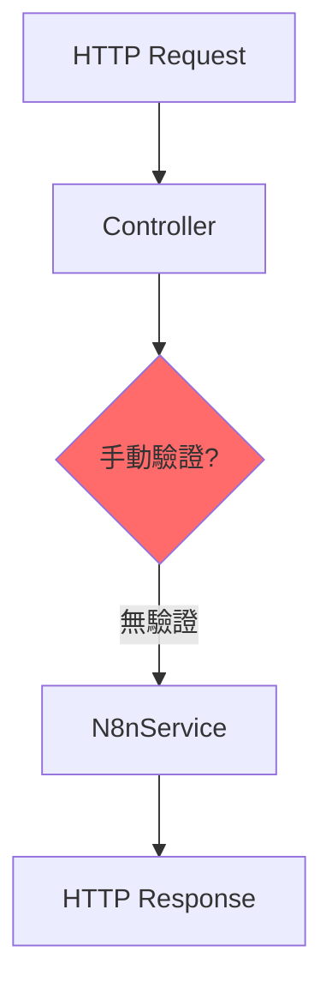
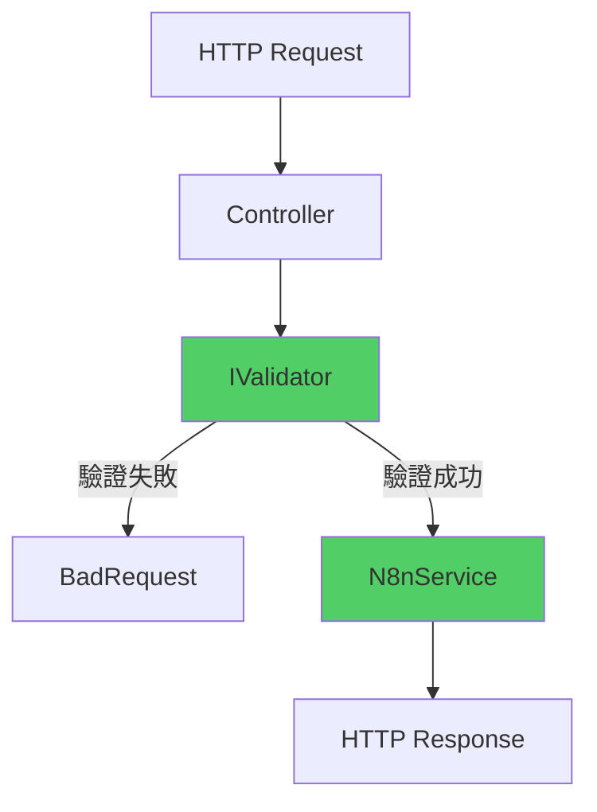

# FluentValidation 整合

為 API 請求加入流暢的驗證機制

<div class="text-sm text-gray-500 mt-4">

<a href="https://github.com/weberyanglalala/Dotnet10Practices/commit/9c1a53307ed65b4955201c9719c011903185f4cf" target="_blank">
=> Git Commit Link
</a>
</div>

---
layout: default
---

# 重構概述

這次重構為 API 請求驗證引入 FluentValidation 函式庫

<v-clicks>

- 📝 **流暢的驗證規則**：使用鏈式語法定義驗證邏輯
- 🔧 **關注點分離**：將驗證邏輯從 Controller 中提取出來
- ✅ **可測試性**：驗證器可獨立進行單元測試
- 📦 **統一錯誤格式**：回傳結構化的驗證錯誤訊息

</v-clicks>

---

# 什麼是 FluentValidation？

流行的 .NET 驗證函式庫

<div class="mt-8">

<v-clicks>

## 🎯 **主要特色**

- **流暢介面**：使用 Lambda 表達式定義驗證規則
- **強型別**：編譯時期檢查，減少錯誤
- **可重用**：驗證邏輯可在多處使用
- **易於測試**：驗證器本身就是可測試的類別

</v-clicks>

</div>

---

# 為什麼需要 FluentValidation？

<div class="grid grid-cols-2 gap-6 mt-8">

<div v-click>
<div class="p-6 bg-red-50 rounded-lg">
<h3 class="text-lg font-bold mb-3">❌ 傳統做法的問題</h3>
<ul class="text-sm space-y-2">
<li>驗證邏輯散落在 Controller 中</li>
<li>使用 Data Annotations 限制較多</li>
<li>複雜驗證規則難以表達</li>
<li>錯誤訊息格式不一致</li>
</ul>
</div>
</div>

<div v-click>
<div class="p-6 bg-green-50 rounded-lg">
<h3 class="text-lg font-bold mb-3">✅ FluentValidation 優勢</h3>
<ul class="text-sm space-y-2">
<li>驗證邏輯集中管理</li>
<li>強大的驗證規則組合</li>
<li>支援複雜的商業邏輯驗證</li>
<li>統一的錯誤處理機制</li>
</ul>
</div>
</div>

</div>

---

# 安裝 FluentValidation

加入 NuGet 套件

````md magic-move {lines: true}
```xml
<!-- WebApplication1.csproj -->
<ItemGroup>
  <!-- 現有套件... -->
</ItemGroup>
```

```xml {*|4-5}
<!-- WebApplication1.csproj -->
<ItemGroup>
  <!-- 現有套件... -->
  <PackageReference Include="FluentValidation" Version="12.1.1" />
  <PackageReference Include="FluentValidation.DependencyInjectionExtensions"
                    Version="12.1.1" />
</ItemGroup>
```
````

<div v-click class="mt-4 p-4 bg-blue-50 rounded text-sm">
💡 需要兩個套件：核心函式庫 + 依賴注入擴充功能
</div>

---

# 建立驗證器類別 (1/2)

定義驗證規則的基本結構

````md magic-move {lines: true}
```csharp
using FluentValidation;
using WebApplication1.Controllers.N8n;

namespace WebApplication1.Validators;

public class CreateProductRequestValidator
    : AbstractValidator<CreateProductRequest>
{
}
```

```csharp {*|9-10}
using FluentValidation;
using WebApplication1.Controllers.N8n;

namespace WebApplication1.Validators;

public class CreateProductRequestValidator
    : AbstractValidator<CreateProductRequest>
{
    public CreateProductRequestValidator()
    {
        // 驗證規則將在這裡定義
    }
}
```
````

---

# 建立驗證器類別 (2/2)

使用流暢語法定義驗證規則

```csharp {*|10-11|12-13|14-15}
public class CreateProductRequestValidator
    : AbstractValidator<CreateProductRequest>
{
    public CreateProductRequestValidator()
    {
        RuleFor(x => x.ProductTitle)
            .NotEmpty()
            .WithMessage("Product Title is required")
            .MinimumLength(3)
            .WithMessage("Product Title must more than 3 characters")
            .MaximumLength(100)
            .WithMessage("Product Title cannot exceed 100 characters");
    }
}
```

<div v-click class="mt-4 p-4 bg-green-50 rounded text-sm">
✅ 使用 Lambda 表達式選擇要驗證的屬性，鏈式呼叫定義規則
</div>

---

# FluentValidation 常用規則

內建的驗證方法

<div class="grid grid-cols-2 gap-4 mt-6">

<div v-click class="text-sm">

**字串驗證**
- `NotEmpty()` - 不可為空
- `NotNull()` - 不可為 null
- `Length(min, max)` - 長度限制
- `MinimumLength(n)` - 最小長度
- `MaximumLength(n)` - 最大長度
- `EmailAddress()` - Email 格式

</div>

<div v-click class="text-sm">

**數值驗證**
- `GreaterThan(n)` - 大於
- `LessThan(n)` - 小於
- `InclusiveBetween(min, max)` - 範圍
- `Must(predicate)` - 自訂規則
- `Matches(regex)` - 正規表達式

</div>

</div>

---

# 註冊驗證器

在 Program.cs 中設定依賴注入

````md magic-move {lines: true}
```csharp
// Program.cs
var builder = WebApplication.CreateBuilder(args);

builder.Services.AddControllersWithViews();
builder.Services.AddHttpClient();
builder.Services.AddScoped<IN8nService, N8nService>();

var app = builder.Build();
```

```csharp {*|1-2|8-9}
// Program.cs
using FluentValidation;
using WebApplication1.Validators;

var builder = WebApplication.CreateBuilder(args);

builder.Services.AddControllersWithViews();
builder.Services.AddHttpClient();
builder.Services.AddScoped<IN8nService, N8nService>();
builder.Services.AddScoped<IValidator<CreateProductRequest>,
    CreateProductRequestValidator>();

var app = builder.Build();
```
````

---

# Controller 修改 (1/4)

移除 ILogger，加入 IValidator

````md magic-move {lines: true}
```csharp
public class N8NController : ControllerBase
{
    private readonly ILogger<N8NController> _logger;
    private readonly IN8nService _n8nService;

    public N8NController(ILogger<N8NController> logger,
        IN8nService n8nService)
    {
        _logger = logger;
        _n8nService = n8nService;
    }
}
```

```csharp {*|3|5-7|9}
public class N8NController : ControllerBase
{
    private readonly IValidator<CreateProductRequest> _createProductRequestValidator;
    private readonly IN8nService _n8nService;

    public N8NController(
        IValidator<CreateProductRequest> createProductRequestValidator,
        IN8nService n8nService)
    {
        _createProductRequestValidator = createProductRequestValidator;
        _n8nService = n8nService;
    }
}
```
````

---

# Controller 修改 (2/4)

加入命名空間與別名

```csharp {*|1|2}
using FluentValidation;
using ValidationResult = FluentValidation.Results.ValidationResult;
using Microsoft.AspNetCore.Mvc;
using WebApplication1.Common;
using WebApplication1.Services;

namespace WebApplication1.Controllers.N8n;
```

<div v-click class="mt-4 p-4 bg-yellow-50 rounded text-sm">
⚠️ 使用別名避免與其他 ValidationResult 類別衝突
</div>

---

# Controller 修改 (3/4)

執行驗證並處理錯誤

```csharp {*|5-6|8-15}
[HttpPost]
public async Task<IActionResult> CreateProduct(
    [FromBody] CreateProductRequest request)
{
    ValidationResult validationResult =
        _createProductRequestValidator.Validate(request);

    if (!validationResult.IsValid)
    {
        var errors = validationResult.Errors
            .GroupBy(e => e.PropertyName)
            .ToDictionary(
                g => g.Key.ToLowerInvariant(),
                g => g.Select(e => e.ErrorMessage).ToArray()
            );
        return BadRequest(errors);
    }
}
```

---

# Controller 修改 (4/4)

完整的驗證流程

```csharp {*|5-15|17-18}
[HttpPost]
public async Task<IActionResult> CreateProduct(
    [FromBody] CreateProductRequest request)
{
    // 1. 驗證請求
    ValidationResult validationResult =
        _createProductRequestValidator.Validate(request);

    if (!validationResult.IsValid)
    {
        var errors = validationResult.Errors
            .GroupBy(e => e.PropertyName)
            .ToDictionary(/* ... */);
        return BadRequest(errors);
    }

    // 2. 呼叫服務層
    var result = await _n8nService.CreateProductAsync(request);

    // 3. 回傳結果...
}
```

---

# 驗證錯誤格式

結構化的錯誤回應

```json
{
  "producttitle": [
    "Product Title is required",
    "Product Title must more than 3 characters"
  ]
}
```

<div v-click class="mt-4 p-4 bg-blue-50 rounded text-sm">
💡 使用 GroupBy 將同一屬性的所有錯誤訊息組合在一起
</div>

---

# 驗證錯誤轉換邏輯

GroupBy 與 ToDictionary 的應用

```csharp {*|3-4|5-7}
var errors = validationResult.Errors
    // 1. 依屬性名稱分組
    .GroupBy(e => e.PropertyName)
    // 2. 轉換成字典
    .ToDictionary(
        g => g.Key.ToLowerInvariant(),        // Key: 小寫屬性名
        g => g.Select(e => e.ErrorMessage)    // Value: 錯誤訊息陣列
              .ToArray()
    );
```

<div v-click class="mt-4 p-4 bg-purple-50 rounded text-sm">
🔄 轉換成前端友善的格式：屬性名對應錯誤訊息陣列
</div>

---
layout: two-cols
layoutClass: gap-12
---

# 重構前



<div class="mt-4 text-sm text-gray-600">
❌ 缺乏系統化的驗證機制
</div>

::right::

# 重構後



<div class="mt-4 text-sm text-gray-600">
✅ 明確的驗證流程
</div>

---

# 重構帶來的好處 (1/2)

<div class="grid grid-cols-2 gap-6 mt-8">

<div v-click>
<div class="p-6 bg-blue-50 rounded-lg">
<h3 class="text-lg font-bold mb-3">🧪 可測試性</h3>
<ul class="text-sm space-y-2">
<li>✓ 驗證器可獨立測試</li>
<li>✓ 不需要建立完整的 HTTP 請求</li>
<li>✓ 測試覆蓋率更高</li>
</ul>
</div>
</div>

<div v-click>
<div class="p-6 bg-green-50 rounded-lg">
<h3 class="text-lg font-bold mb-3">🔧 可維護性</h3>
<ul class="text-sm space-y-2">
<li>✓ 驗證邏輯集中管理</li>
<li>✓ 易於修改驗證規則</li>
<li>✓ Controller 更簡潔</li>
</ul>
</div>
</div>

</div>

---

# 重構帶來的好處 (2/2)

<div class="grid grid-cols-2 gap-6 mt-8">

<div v-click>
<div class="p-6 bg-purple-50 rounded-lg">
<h3 class="text-lg font-bold mb-3">♻️ 可重用性</h3>
<ul class="text-sm space-y-2">
<li>✓ 驗證器可在多處使用</li>
<li>✓ 避免重複驗證邏輯</li>
<li>✓ 統一的驗證標準</li>
</ul>
</div>
</div>

<div v-click>
<div class="p-6 bg-orange-50 rounded-lg">
<h3 class="text-lg font-bold mb-3">📊 更好的 API</h3>
<ul class="text-sm space-y-2">
<li>✓ 結構化錯誤訊息</li>
<li>✓ 前端易於處理</li>
<li>✓ 一致的回應格式</li>
</ul>
</div>
</div>

</div>

---

# 進階用法：複雜驗證規則

自訂驗證邏輯

```csharp {*|6-8|10-13}
public class CreateProductRequestValidator
    : AbstractValidator<CreateProductRequest>
{
    public CreateProductRequestValidator()
    {
        RuleFor(x => x.ProductTitle)
            .NotEmpty().WithMessage("Product Title is required")
            .MinimumLength(3)
            .WithMessage("Product Title must more than 3 characters");

        // 自訂驗證規則
        RuleFor(x => x.Price)
            .GreaterThan(0).WithMessage("Price must be greater than 0")
            .Must(BeValidPrice).WithMessage("Price format is invalid");
    }

    private bool BeValidPrice(decimal price)
    {
        // 自訂驗證邏輯
        return price % 0.01m == 0; // 最多兩位小數
    }
}
```

---

# 進階用法：條件式驗證

When() 方法的應用

```csharp {*|6-11}
public class CreateProductRequestValidator
    : AbstractValidator<CreateProductRequest>
{
    public CreateProductRequestValidator()
    {
        // 只在特定條件下執行驗證
        When(x => x.IsDiscounted, () =>
        {
            RuleFor(x => x.DiscountPercentage)
                .InclusiveBetween(1, 99)
                .WithMessage("Discount must be between 1% and 99%");
        });
    }
}
```

---

# 測試驗證器

單元測試範例

```csharp
public class CreateProductRequestValidatorTests
{
    private readonly CreateProductRequestValidator _validator = new();

    [Fact]
    public void Should_Have_Error_When_Title_Is_Empty()
    {
        var request = new CreateProductRequest { ProductTitle = "" };
        var result = _validator.Validate(request);

        Assert.False(result.IsValid);
        Assert.Contains(result.Errors,
            e => e.PropertyName == "ProductTitle");
    }

    [Fact]
    public void Should_Not_Have_Error_When_Title_Is_Valid()
    {
        var request = new CreateProductRequest { ProductTitle = "Valid Title" };
        var result = _validator.Validate(request);

        Assert.True(result.IsValid);
    }
}
```

---

# 關鍵設計決策

<div class="mt-8">

<v-clicks>

### 1️⃣ 使用別名避免命名衝突

`using ValidationResult = FluentValidation.Results.ValidationResult;`

### 2️⃣ 移除 ILogger 簡化依賴

驗證失敗不需要記錄日誌，直接回傳錯誤即可

### 3️⃣ 屬性名稱轉小寫

`g.Key.ToLowerInvariant()` 符合 JSON 命名慣例

</v-clicks>

</div>

---
layout: fact
---

# 從手動驗證到宣告式驗證

FluentValidation 讓驗證邏輯更清晰、更易維護

---
layout: end
class: text-center
---

# 學習更多

探索 FluentValidation 的更多功能

<div class="mt-8 text-sm text-gray-500">
Commit: 9c1a53307ed65b4955201c9719c011903185f4cf
</div>
