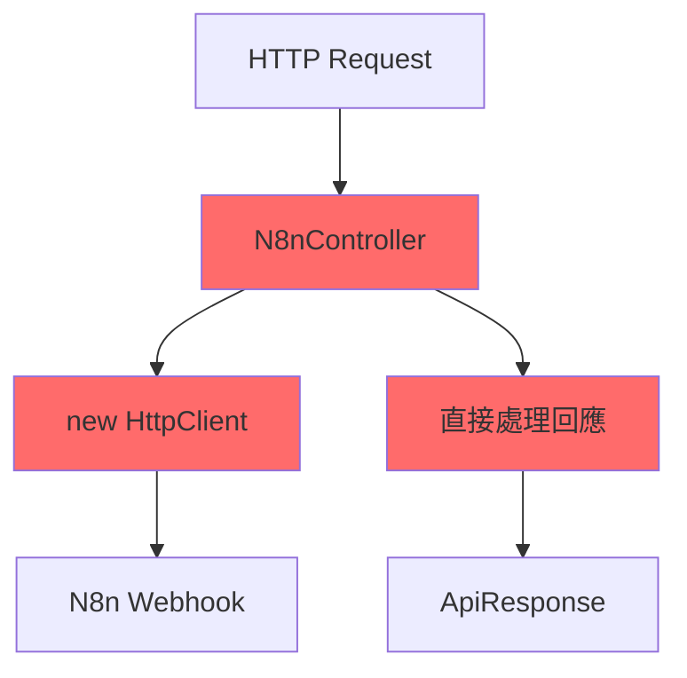
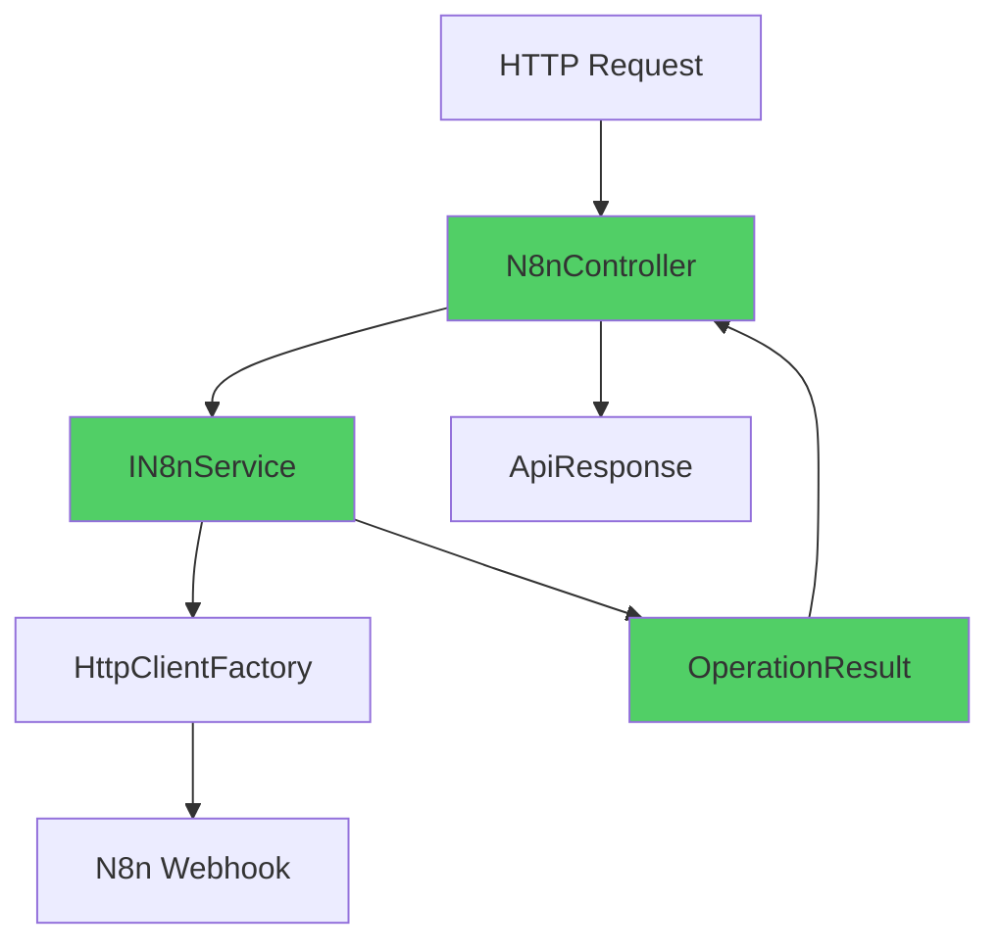

# N8nController 重構

提取服務層與統一回應處理

<div class="text-sm text-gray-500 mt-4">

<a href="https://github.com/weberyanglalala/Dotnet10Practices/commit/e0cc829707b8d055a58ccabb208c8ab0be9fa671" target="_blank">
=> Git Commit Link
</a>
</div>

---
layout: default
---

# 重構概述

這次重構主要改善了程式碼的組織架構，並引入了統一的回應處理機制。

<v-clicks>

- 🔧 **關注點分離**：將 N8n API 呼叫邏輯從 Controller 提取至 Service 層
- 📦 **統一回應格式**：引入 `OperationResult<T>` 泛型類別
- ✅ **提升可測試性**：透過依賴注入讓單元測試更容易撰寫
- 🎯 **提升可維護性**：集中化的 N8n 邏輯讓未來修改更簡單

</v-clicks>

---
layout: two-cols
layoutClass: gap-16
---

# 重構前的問題

Controller 承擔過多職責

::right::

## 程式碼異味

<v-clicks>

- 🔴 Controller 直接建立 HttpClient
- 🔴 商業邏輯與 HTTP 關注點混雜
- 🔴 難以進行單元測試
- 🔴 缺乏完整的錯誤處理機制

</v-clicks>

---

# OperationResult 的設計理念

統一的服務層回應格式

<v-clicks>

## 🎯 **主要用途**

- **服務層操作結果**：封裝所有 Service 方法的執行結果
- **成功/失敗狀態**：明確表示操作是否成功
- **統一錯誤處理**：標準化的錯誤訊息與狀態碼
- **型別安全**：泛型設計確保資料型別正確性

</v-clicks>

---

# 為什麼需要 OperationResult

<div v-click class="mt-8 p-6 bg-blue-50 rounded-lg">
<h3 class="text-lg font-bold mb-3">📦 為什麼需要 OperationResult？</h3>
<ul class="text-sm space-y-2">
<li>❌ 傳統方式：拋出例外或回傳 null</li>
<li>✅ 統一方式：總是回傳 OperationResult，包含成功/失敗狀態</li>
<li>🎯 明確性：呼叫者立即知道操作結果</li>
<li>🔒 型別安全：編譯時期檢查，減少執行時期錯誤</li>
</ul>
</div>

---

# 新增：OperationResult.cs (1/2)

不可變的結果包裝類別

````md magic-move {lines: true}
```csharp
// 基本結構：不可變屬性
public class OperationResult<T>
{
    public bool IsSuccess { get; }
    public T Data { get; }
    public string ErrorMessage { get; }
    public int Code { get; }
}
```

```csharp {*|10-16}
// 加入私有建構子確保只能透過工廠方法建立
public class OperationResult<T>
{
    public bool IsSuccess { get; }
    public T Data { get; }
    public string ErrorMessage { get; }
    public int Code { get; }

    private OperationResult(bool isSuccess, T data,
        string errorMessage, int code)
    {
        IsSuccess = isSuccess;
        Data = data;
        ErrorMessage = errorMessage;
        Code = code;
    }
}
```
````

---

# 新增：OperationResult.cs (2/2)

工廠方法確保物件正確建立

````md magic-move {lines: true}
```csharp
private OperationResult(bool isSuccess, T data,
    string errorMessage, int code)
{
    IsSuccess = isSuccess;
    Data = data;
    ErrorMessage = errorMessage;
    Code = code;
}
```

```csharp {*|10-13}
private OperationResult(bool isSuccess, T data,
    string errorMessage, int code)
{
    IsSuccess = isSuccess;
    Data = data;
    ErrorMessage = errorMessage;
    Code = code;
}

public static OperationResult<T> Success(T data, int statusCode = 200)
{
    return new OperationResult<T>(true, data, null, statusCode);
}
```

```csharp {*|10-14}
private OperationResult(bool isSuccess, T data,
    string errorMessage, int code)
{
    IsSuccess = isSuccess;
    Data = data;
    ErrorMessage = errorMessage;
    Code = code;
}

public static OperationResult<T> Failure(
    string errorMessage = "Operation Failed.", int statusCode = 400)
{
    return new OperationResult<T>(false, default, errorMessage, statusCode);
}
```
````

---

# 新增：N8nService.cs (1/7)

定義服務介面

```csharp
using WebApplication1.Common;
using WebApplication1.Controllers.N8n;

namespace WebApplication1.Services;

public interface IN8nService
{
    Task<OperationResult<CreateProductResponse>> CreateProductAsync(
        CreateProductRequest request);
}
```

<div v-click class="mt-4 p-4 bg-blue-50 rounded text-sm">
💡 使用介面設計支援依賴注入與單元測試
</div>

---

# 新增：N8nService.cs (2/7)

建構子與依賴注入

```csharp {*|3-5|7-13}
public class N8nService : IN8nService
{
    private readonly ILogger<N8nService> _logger;
    private readonly IConfiguration _configuration;
    private readonly IHttpClientFactory _httpClientFactory;

    public N8nService(ILogger<N8nService> logger,
        IConfiguration configuration,
        IHttpClientFactory httpClientFactory)
    {
        _logger = logger;
        _configuration = configuration;
        _httpClientFactory = httpClientFactory;
    }
}
```

---

# IHttpClientFactory 簡介

ASP.NET Core 中的 HTTP 用戶端工廠

<v-clicks>

## 🎯 **主要優點**

- **集中管理**：命名和設定邏輯 HttpClient 執行個體的中心位置
- **中介軟體支援**：透過委派處理常式撰寫傳出中介軟體
- **生命週期管理**：自動管理基礎 HttpClientMessageHandler 的共用和存留期
- **避免 DNS 問題**：解決手動管理 HttpClient 存留期的常見問題
- **可設定記錄**：針對所有要求提供記錄體驗

</v-clicks>

<div v-click class="mt-6 p-4 bg-blue-50 rounded text-sm">
💡 IHttpClientFactory 提供適用於 Polly 型中介軟體的延伸模組
</div>

---

# IHttpClientFactory 註冊

在 Program.cs 中設定

```csharp {*|7-8}
// Program.cs
var builder = WebApplication.CreateBuilder(args);

// Add services to the container.
builder.Services.AddControllersWithViews();

// 註冊 IHttpClientFactory
builder.Services.AddHttpClient();

var app = builder.Build();
```

<div v-click class="mt-4 p-4 bg-green-50 rounded text-sm">
✅ 呼叫 `AddHttpClient()` 即可註冊 IHttpClientFactory 服務
</div>

---

# IHttpClientFactory 基本用法

建立 HttpClient 執行個體

```csharp {*|3-9|13|15}
public class ExampleService
{
    private readonly IHttpClientFactory _httpClientFactory;

    public ExampleService(IHttpClientFactory httpClientFactory)
    {
        _httpClientFactory = httpClientFactory;
    }

    public async Task<string> GetDataAsync()
    {
        // 建立 HttpClient 執行個體
        var httpClient = _httpClientFactory.CreateClient();
        
        var response = await httpClient.GetAsync("https://api.example.com/data");
        
        if (response.IsSuccessStatusCode)
        {
            return await response.Content.ReadAsStringAsync();
        }
        
        return null;
    }
}
```

---

# IHttpClientFactory 與依賴注入

在 Service 中使用

```csharp {*|3-5|7-14}
public class N8nService : IN8nService
{
    private readonly ILogger<N8nService> _logger;
    private readonly IConfiguration _configuration;
    private readonly IHttpClientFactory _httpClientFactory;

    public N8nService(ILogger<N8nService> logger,
        IConfiguration configuration,
        IHttpClientFactory httpClientFactory)
    {
        _logger = logger;
        _configuration = configuration;
        _httpClientFactory = httpClientFactory;
    }
}
```

<div v-click class="mt-4 p-4 bg-purple-50 rounded text-sm">
🔄 每次呼叫 `CreateClient()` 都會取得新的 HttpClient 執行個體，但底層連線會被重用
</div>

---

# 參考資料

<div class="mt-8">
<h3 class="text-lg font-bold mb-4">📚 相關連結</h3>
<ul class="space-y-2">
<li><a href="https://learn.microsoft.com/zh-tw/aspnet/core/fundamentals/http-requests?view=aspnetcore-10.0" target="_blank" class="text-blue-600 hover:text-blue-800">在 ASP.NET Core 中使用 IHttpClientFactory 發出 HTTP 要求</a></li>
<li>作者：Kirk Larkin、Steve Gordon、Glenn Condron 和 Ryan Nowak</li>
</ul>
</div>

---

# 新增：N8nService.cs (3/7)

驗證 Webhook Endpoint 設定

```csharp {*|5-6|8-13}
public async Task<OperationResult<CreateProductResponse>>
    CreateProductAsync(CreateProductRequest request)
{
    try {
        var client = _httpClientFactory.CreateClient();
        var endpoint = _configuration["N8nWebhookEndpoint"];

        if (string.IsNullOrEmpty(endpoint))
        {
            _logger.LogError("N8nWebhookEndpoint configuration is missing");
            return OperationResult<CreateProductResponse>.Failure(
                "N8n webhook endpoint not configured", 500);
        }
    }
}
```

---

# 新增：N8nService.cs (4/7)

驗證 API Key 並設定授權標頭

```csharp {*|4-10|12-14}
var endpoint = _configuration["N8nWebhookEndpoint"];
// ... endpoint validation ...

var apiKey = _configuration["N8nApiKey"];
if (string.IsNullOrEmpty(apiKey))
{
    _logger.LogError("N8nApiKey configuration is missing");
    return OperationResult<CreateProductResponse>.Failure(
        "N8n API key not configured", 500);
}

client.DefaultRequestHeaders.Authorization =
    new AuthenticationHeaderValue("Bearer", apiKey);
_logger.LogInformation("Sending request to N8n webhook: {Endpoint}", endpoint);
```

---

# 新增：N8nService.cs (5/7)

發送請求並處理失敗回應

```csharp {*|3|5-12}
_logger.LogInformation("Sending request to N8n webhook: {Endpoint}", endpoint);

var response = await client.PostAsJsonAsync(endpoint, request);

if (!response.IsSuccessStatusCode)
{
    var errorContent = await response.Content.ReadAsStringAsync();
    _logger.LogError("N8n webhook returned error status {StatusCode}: {Error}",
        response.StatusCode, errorContent);
    return OperationResult<CreateProductResponse>.Failure(
        $"N8n webhook error: {response.StatusCode}", (int)response.StatusCode);
}
```

---

# 新增：N8nService.cs (6/7)

處理空回應與反序列化

```csharp {*|5-10|12-19}
var response = await client.PostAsJsonAsync(endpoint, request);

var responseString = await response.Content.ReadAsStringAsync();

if (string.IsNullOrEmpty(responseString))
{
    _logger.LogError("N8n webhook returned empty response");
    return OperationResult<CreateProductResponse>.Failure(
        "Empty response from N8n webhook", 502);
}

var result = JsonSerializer.Deserialize<CreateProductResponse>(responseString);

if (result == null)
{
    _logger.LogError("Failed to deserialize N8n response: {Response}", responseString);
    return OperationResult<CreateProductResponse>.Failure(
        "Invalid response format from N8n webhook", 502);
}
```

---

# 新增：N8nService.cs (7/7)

成功處理與例外捕捉

```csharp {*|4-7|9-14|15-20}
try
{
    // .....
    var result = JsonSerializer.Deserialize<CreateProductResponse>(responseString);

    _logger.LogInformation("Successfully created product via N8n webhook");
    return OperationResult<CreateProductResponse>.Success(result, 200);
}
catch (HttpRequestException ex)
{
    _logger.LogError(ex, "HttpRequestException occurred while calling N8n webhook");
    return OperationResult<CreateProductResponse>.Failure(
        $"Network error: {ex.Message}", 503);
}
catch (Exception ex)
{
    _logger.LogError(ex, "Unexpected error occurred in CreateProductAsync");
    return OperationResult<CreateProductResponse>.Failure(
        "An unexpected error occurred", 500);
}
```

---

# Controller 重構 (1/3)

重構前：直接建立 HttpClient 與處理請求

```csharp
[HttpPost]
public async Task<IActionResult> CreateProduct(
    [FromBody] CreateProductRequest request)
{
    var client = new HttpClient();
    var endpoint = _configuration["N8nWebhookEndpoint"];
    client.DefaultRequestHeaders.Authorization =
        new AuthenticationHeaderValue("Bearer", _configuration["N8nApiKey"]);
    var response = await client.PostAsJsonAsync(endpoint, request);
    var responseString = await response.Content.ReadAsStringAsync();
    var result = JsonSerializer.Deserialize<CreateProductResponse>(responseString);
    return Ok(new ApiResponse<CreateProductResponse>
    {
        Data = result,
        Code = 200,
        Message = "取得商品資料成功"
    });
}
```

---

# Controller 重構 (2/3)

重構後：委派給 Service 處理

```csharp {*|1-6|14-17|18-21}
// 注入 IN8nService 而非 IConfiguration
public N8NController(ILogger<N8NController> logger, IN8nService n8nService)
{
    _logger = logger;
    _n8nService = n8nService;
}

[HttpPost]
public async Task<IActionResult> CreateProduct(
    [FromBody] CreateProductRequest request)
{
    var result = await _n8nService.CreateProductAsync(request);

    if (result.IsSuccess)
    {
        // 成功處理...
    }
    else
    {
        // 錯誤處理...
    }
}
```

---

# Controller 重構 (3/3)

完整的成功與錯誤處理

```csharp

[HttpPost]
public async Task<IActionResult> CreateProduct(
    [FromBody] CreateProductRequest request)
{
    var result = await _n8nService.CreateProductAsync(request);

    if (result.IsSuccess)
    {
        return Ok(new ApiResponse<CreateProductResponse>
        {
            Data = result.Data,
            Code = result.Code,
            Message = "取得商品資料成功"
        });
    }
    else
    {
        return Problem(
            detail: result.ErrorMessage,
            statusCode: result.Code,
            title: "Create Product Failed"
        );
    }
}
```

---

# 依賴注入設定

Program.cs 的變更

````md magic-move {lines: true}
```csharp
// 重構前
var builder = WebApplication.CreateBuilder(args);

builder.Services.AddControllersWithViews();

var app = builder.Build();
```

```csharp {*|1|6-8}
// 重構後
using WebApplication1.Services;

var builder = WebApplication.CreateBuilder(args);

builder.Services.AddControllersWithViews();
builder.Services.AddHttpClient();
builder.Services.AddScoped<IN8nService, N8nService>();

var app = builder.Build();
```
````

---
layout: two-cols
layoutClass: gap-12
---

# 重構前架構



<div class="mt-4 text-sm text-gray-600">
❌ Controller 承擔過多職責
</div>

::right::

# 重構後架構



<div class="mt-4 text-sm text-gray-600">
✅ 清楚的職責分離
</div>

---

# 重構帶來的好處 (1/2)

<div class="grid grid-cols-2 gap-6 mt-8">

<div v-click>
<div class="p-6 bg-blue-50 rounded-lg">
<h3 class="text-lg font-bold mb-3">🧪 可測試性提升</h3>
<ul class="text-sm space-y-2">
<li>✓ 可模擬 IN8nService 介面</li>
<li>✓ 可獨立測試服務邏輯</li>
<li>✓ 使用 IHttpClientFactory</li>
</ul>
</div>
</div>

<div v-click>
<div class="p-6 bg-green-50 rounded-lg">
<h3 class="text-lg font-bold mb-3">🔧 可維護性提升</h3>
<ul class="text-sm space-y-2">
<li>✓ 單一職責原則</li>
<li>✓ 程式碼更易於理解</li>
<li>✓ 修改影響範圍小</li>
</ul>
</div>
</div>

</div>

---

# 重構帶來的好處 (2/2)

<div class="grid grid-cols-2 gap-6 mt-8">

<div v-click>
<div class="p-6 bg-purple-50 rounded-lg">
<h3 class="text-lg font-bold mb-3">♻️ 可重用性提升</h3>
<ul class="text-sm space-y-2">
<li>✓ Service 可在多處使用</li>
<li>✓ OperationResult 統一格式</li>
<li>✓ 避免程式碼重複</li>
</ul>
</div>
</div>

<div v-click>
<div class="p-6 bg-orange-50 rounded-lg">
<h3 class="text-lg font-bold mb-3">📊 錯誤處理改善</h3>
<ul class="text-sm space-y-2">
<li>✓ 完整的驗證與日誌記錄</li>
<li>✓ 區分網路錯誤與一般錯誤</li>
<li>✓ 明確的錯誤訊息</li>
</ul>
</div>
</div>

</div>

---

# 關鍵設計決策 (1/2)

<div class="mt-8">

<v-clicks>

### 1️⃣ 不可變的 OperationResult

使用 `{ get; }` 與私有建構子確保物件建立後不可修改

### 2️⃣ 使用 Bearer Token 認證

`AuthenticationHeaderValue("Bearer", apiKey)` 符合標準的 OAuth 2.0 規範

</v-clicks>

</div>

---

# 關鍵設計決策 (2/2)

<div class="mt-8">

<v-clicks>

### 3️⃣ 完整的錯誤處理

- 驗證設定存在
- 檢查空回應
- 驗證反序列化結果
- 區分 HttpRequestException 與一般例外

### 4️⃣ 使用 PostAsJsonAsync

比手動序列化更簡潔，自動處理 Content-Type

</v-clicks>

</div>